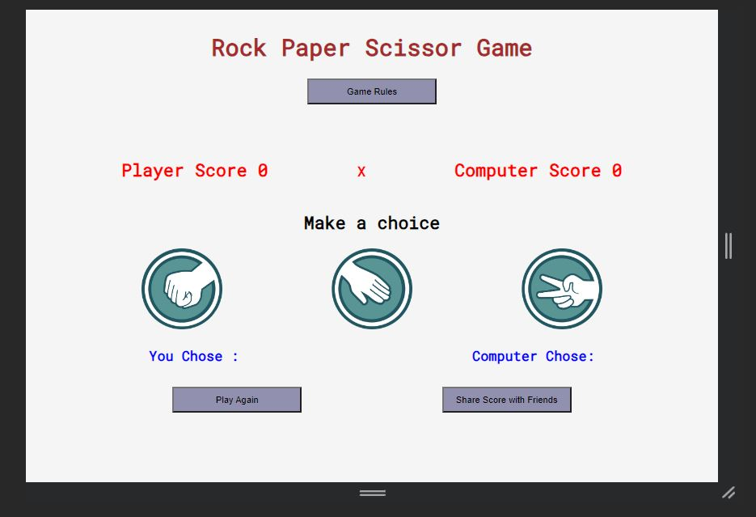
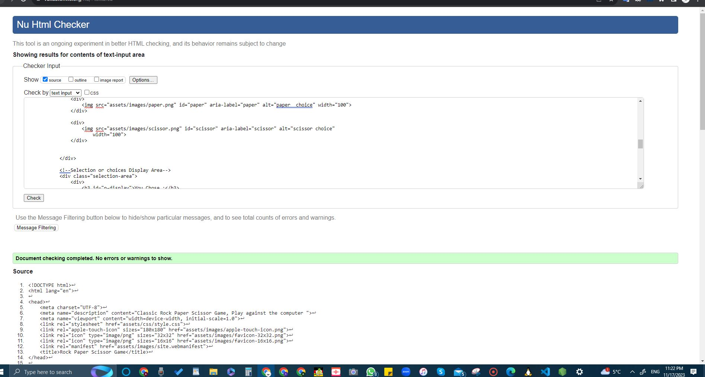

# Rock Paper Scissor Game

---

[Rock Paper Scissor Game](https://syricano.github.io/project2/) is a game website designed for the classic Rock Paper Scissor Game for online users.

---

## User Stories

### First Time Visitors Goals:
- As a First-Time visitor, I want to understand the main purpose of the site easily, and learn more about the features.
- As a First-Time Visitor, I want to navigate easily throughout the site.
- As a new player, I want to understand the rules of the game, so I can play confidently.
- As a player, I want to easily see my current score, so I can track my progress.
- As a player, I want to make my game choice easily, so I can quickly participate.
- As a player, I want to see what choices I and the computer made, so I can understand the outcome.
- As a player, I want to know the result of each round, so I can understand who won.
- As a player, I want to easily reset the game and play again, so I can continue enjoying the game.

### Returning Visitor Goals:
- As a Returned Visitor, I want to share my score with friends, so I can challenge them.

## Technologies used

- HTML
- CSS
- Javascript
- Google fonts
- Fav icons

## Features

### Title
-Positioned at the top of the page.
### Game Rules
- Positioned below the title .
- a Button that can be clicked to show the user games rules.
- It can be popped up and hide the content.

### Score Area
- Positioned below the title of the page.
- It starts with 0 for each side ( user & computer)
- It changes the value for every player when winning.

### Make a Choice
- It has 3 images.
- Each image can be clicked to set the player selection.
- It has a display area to show what each player selected.

### Hidden Result Area

- POsitioned below choices area and prints the winner of the game.

### Play Again
- Play Again button to keep playing.

### Share with Friends Button
- It shares the result of the game through social media 

## Footer
- It has the author info

---

## Testing
- I tested that website works in different browser; Chrome , firefox.
- I used devtools and responsiveness website [Responsive Website Design Tester](https://responsivedesignchecker.com/) to confirm that the website is responsive and all work and load as suppose to.

### Bugs

#### Unsolved bugs
- None.

#### Solved bugs 
 - styling bug : an incorrect settings of rules button lead to expand the html file , then it was resolved by removing the z-index and minus values.
 - The games rules button was not correctly or nicely aligned with the other share and play again buttons due to the span that is connected to it. so I solved it by moving its divs and position to the top of the page so the user also reads the rules before playing.

 ### Validator Testing

 - #### HTML
 - No errors were found when passing through the official w3c.
 
 - ##### CSS
   No errors or warnings were found when passing through the official W3C (Jigsaw) validator.
  
- ##### Accessibility and performance
  Using lighthouse in devtools I confirmed that the website is performing well, accessible and colors and fonts chosen are readable.
    
    
    

---

 ## Deployment
 - The website was deployed to Github pages and can be accessed from github through  the link : [Repository Project2](https://github.com/syricano/project2), the live website can be accessed here :[Project 2](https://syricano.github.io/project2/)
 Deployment steps were done as the following:
 1. On Github, selecting the project repository then going to settings.
 2. clicking on pages, then selecting deploy from a branch, and selecting Main page.
 3. Clicking Save   

 ---

## Credits 
- The pictures were downloaded from with no author requirement [Icon Library ](https://icon-library.com
)

